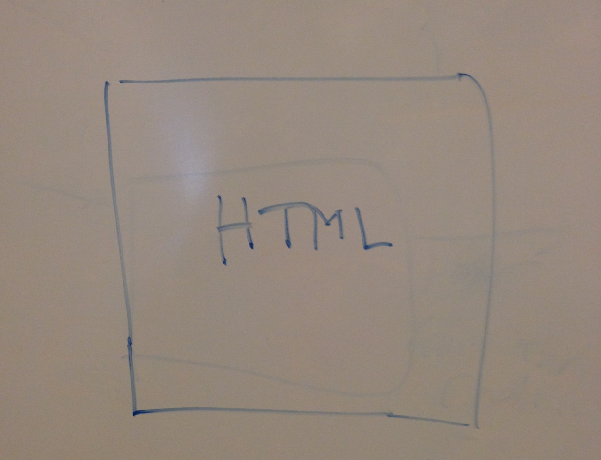
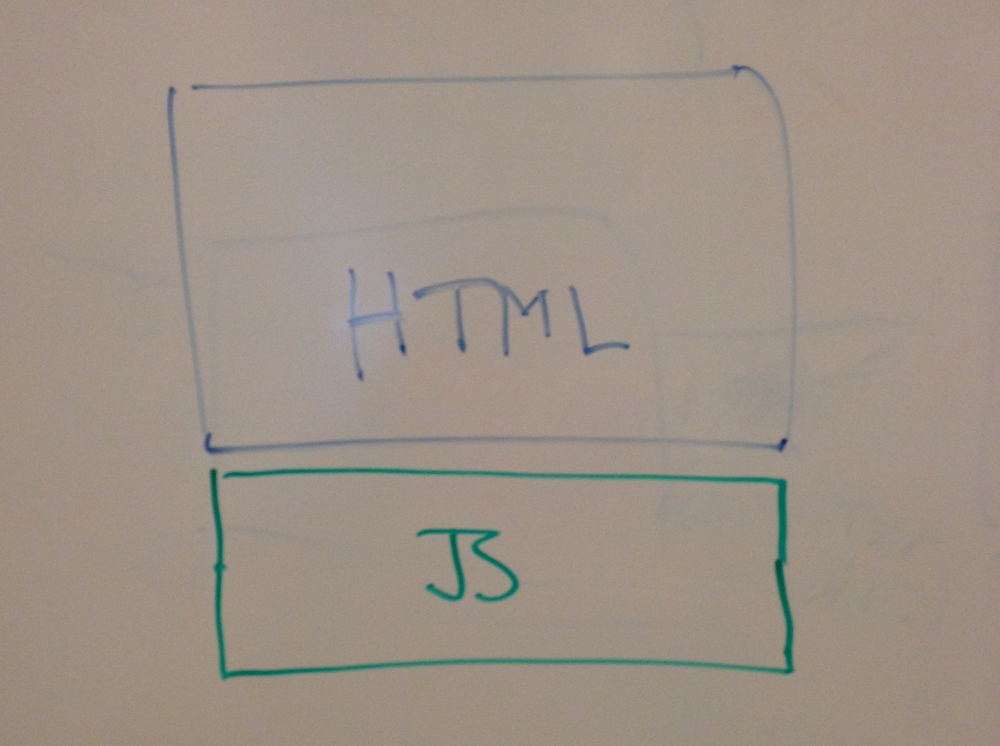
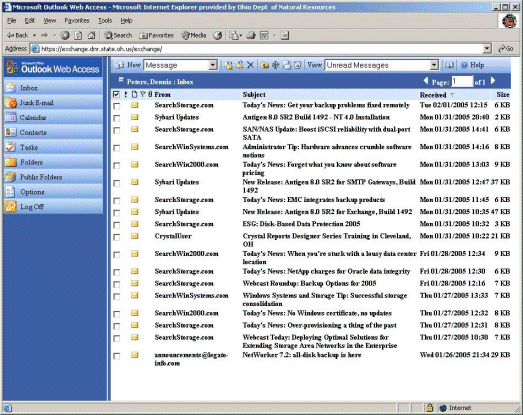
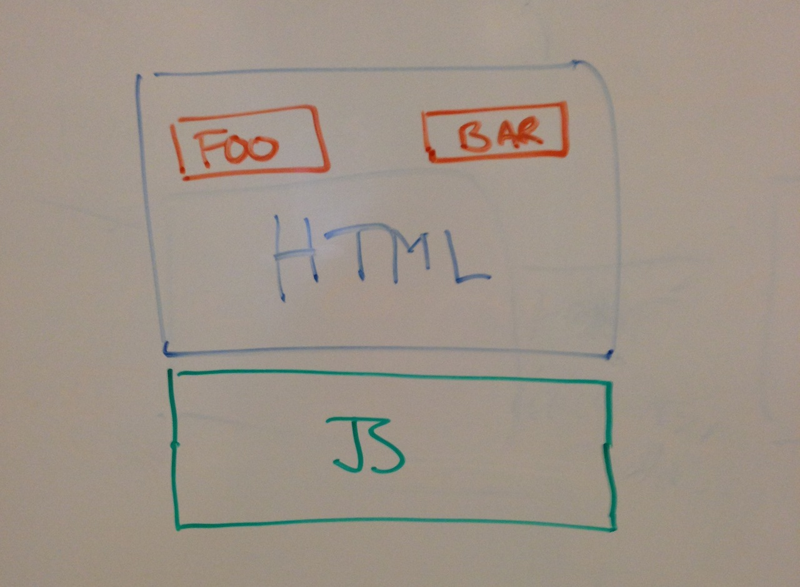
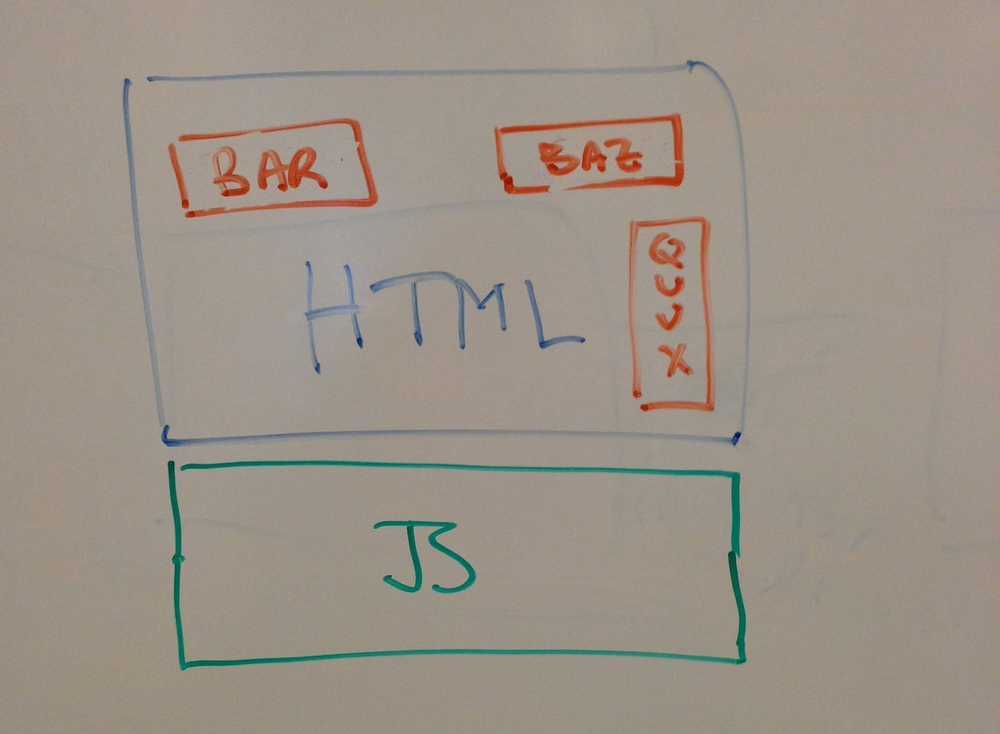
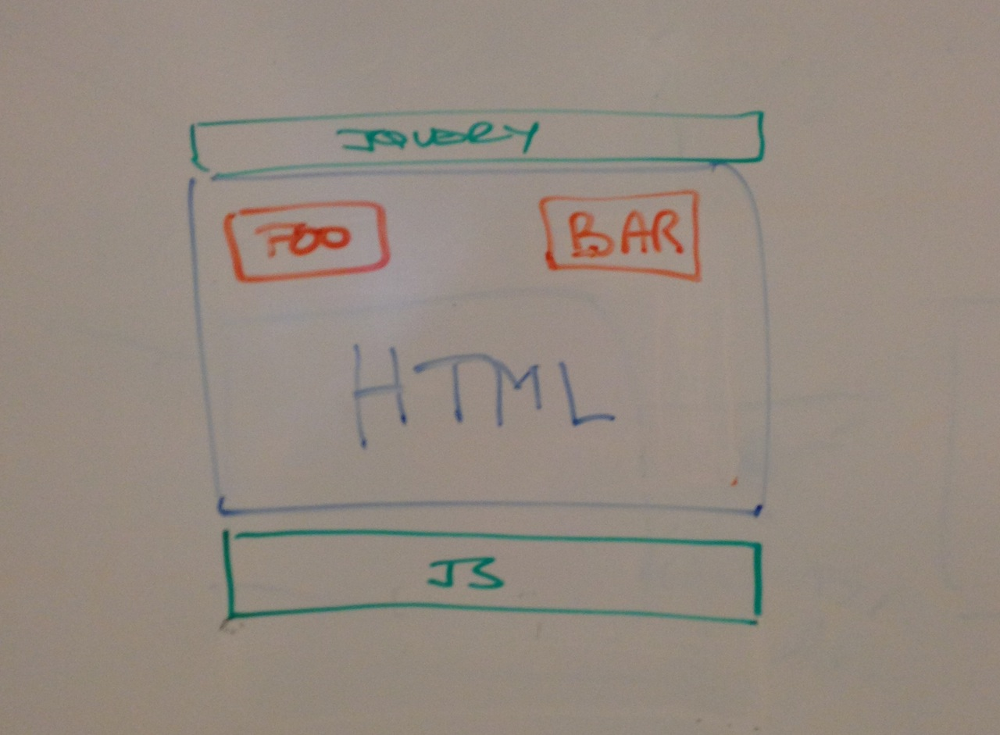
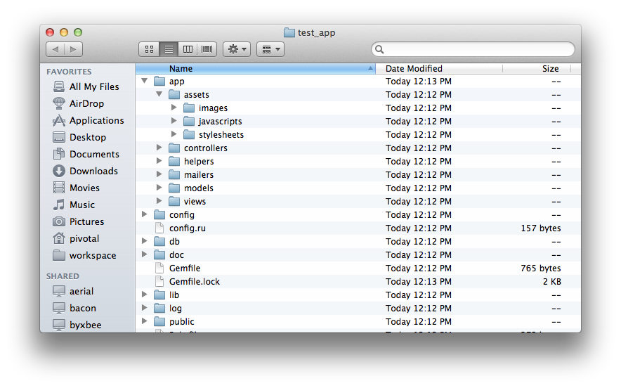
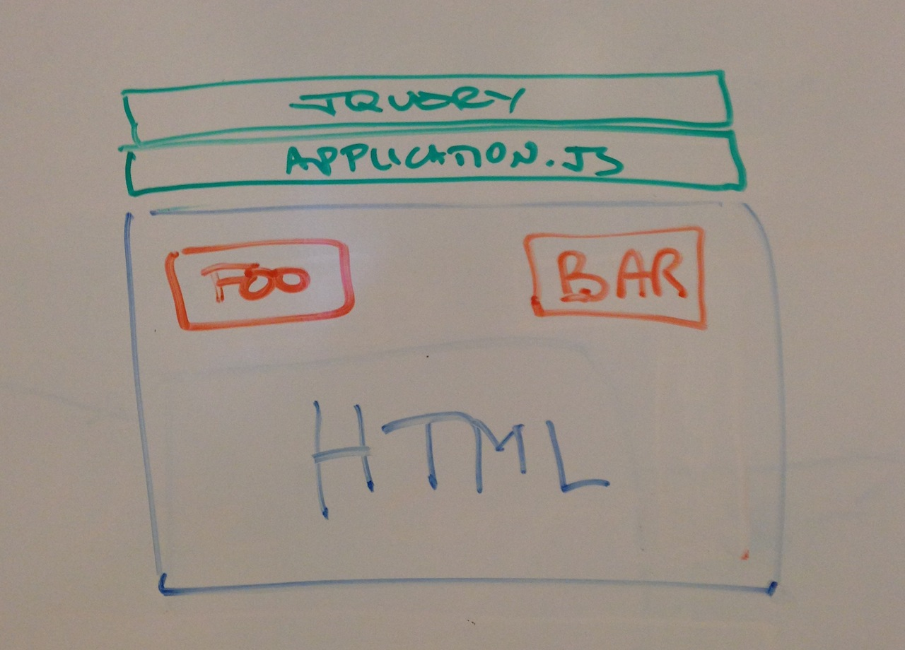
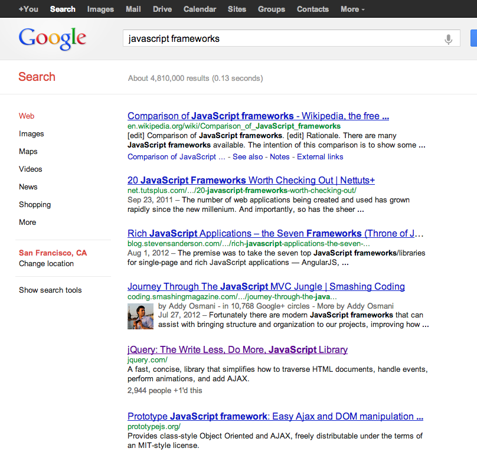

# 2012.11.05.cs169

!SLIDE

# JavaScript in your Rails
 
dwfrank@pivotallabs.com | @dwfrank | github.com/infews

!SLIDE

# 1. Why JS?

!SLIDE

# Web apps serve HTML documents

!SLIDE

!SLIDE

# Enter JS and the DOM

!SLIDE

# Another Language??

## Browsers' programmatic interface
## "Enhance" the page

!SLIDE left

# Examples

* ["Romney Tax Plan"][mitt]
* [XKCD: _Click and Drag_][xkcd]
* [Apple iPhone5 Design 'videos'][iphone] and [how it works][iphone_how]

[mitt]: http://www.romneytaxplan.com/
[xkcd]: http://xkcd.com/1110/
[iphone]: http://www.apple.com/iphone/design/
[iphone_how]: https://docs.google.com/document/pub?id=1GWTMLjqQsQS45FWwqNG9ztQTdGF48hQYpjQHR_d1WsI

!SLIDE bottom-left

# Learning JS

}}} images/rhino.jpg

!SLIDE

## Listen to an event

## Execute a `function`

!SLIDE

@@@ javascript
function renameUser() {
  var nameElements = document.getElementsByClassName('username');
  for (var i=0; i< nameElements.length; i++) {
    var el = nameElements[i];
    el.innerHTML = "Armando";
  }
}
var button = document.getElementById("name-changer");
button.addEventListener('click', renameUser);
@@@

!SLIDE

!SLIDE

# So What?

!SLIDE

# 2. A Brief History of AJAX

!SLIDE

!SLIDE

@@@ javascript
var xhr = new XMLHttpRequest();
xhr.open("GET", "/user/new", true);
xhr.onreadystatechange = function() {
 if (xhr.readyState == 4) {
  // success! play with properties
 }
};
xhr.send();
@@@

!SLIDE

# Interact with the server
 
## Show results to the user
## _on the same page_

!SLIDE

!SLIDE

!SLIDE left

# Better Examples

* [Twitter][tw]
* [NYTimes Skimmer][nyt]
* [ESPN SC Feed][espn]

[tw]: http://twitter.com
[nyt]: http://nytimes.com/chrome
[espn]: http://espn.com/scfeed

!SLIDE left

# Our Document Evolves

* Static Document
* Fun interactive things
* Snappier UI response
* Applications - "single page apps" is the buzzphrase

!SLIDE

# 3. JavaScript on its own

!SLIDE bottom-left

# Remember me?

}}} images/rhino.jpg

!SLIDE top-left

# Ugh.

}}} images/rhino_index.jpg

!SLIDE top-left

# README

}}} images/goodparts.jpg

!SLIDE

# What about DOM?

!SLIDE

!SLIDE left

# CSS notation for finding elements

* `#` for ID
  * `#mybutton`
  * `#update`
* `.` for classnames
  * `.username`
  * `.location`

!SLIDE

# Before

@@@ javascript
function renameUser() {
  var nameElements = document.getElementsByClassName('username');
  for (var i=0; i< nameElements.length; i++) {
    var el = nameElements[i];
    el.innerHTML = "Armando";
  }
}
var button = document.getElementById("name-changer");
button.addEventListener('click', renameUser);
@@@

!SLIDE

# After
@@@ javascript
$('#name-changer').click(function() {
  $('.username').each(function() {
    $(this).text("Armando");
  });
});
@@@

!SLIDE

# Before

@@@ javascript
var xhr = new XMLHttpRequest();
xhr.open("GET", "/user/new", true);
xhr.onreadystatechange = function() {
 if (xhr.readyState == 4) {
  // success! play with properties
 }
};
xhr.send();
@@@

!SLIDE

# After

@@@ javascript
$.ajax({
  url: "/user/new"
}).done(function(data) {
  // success! play with properties
}).error(function() {
  console.error('whoops');
});
@@@

!SLIDE

!SLIDE

## It's a framework!
## It's a browser API adapter!

!SLIDE

# 4. What about testing?

!SLIDE

## Making JS safe for Rubyists since 2008

!SLIDE

@@@ javascript
describe("Deck", function() {
  var deck;

  describe("with jokers", function() {
    beforeEach(function() {
      deck = new Deck({jokers: true});
    });

    it("should have the correct count of cards", function() {
      expect(deck.count).toEqual(54);
    });
  });

  describe("without jokers", function() {
    beforeEach(function() {
      deck = new Deck({jokers: false});
    });

    it("should have the correct count of cards", function() {
      expect(deck.count).toEqual(52);
    });
  });
});
@@@

!SLIDE left

# Other Jasmine goodies

* Mock clock
* Spies for test doubles
* AJAX faking ([Jasmine AJAX](http://github.com/pivotal/jasmine-ajax))
* Custom Matchers
* Async test support

!SLIDE

# [Tutorial Page](http://pivotal.github.com/jasmine/)

## Has the full interface

!SLIDE

!SLIDE

# 5. Rails && JS

!SLIDE

!SLIDE left

# Server-side

* receive an HTTP request
* query for some data
* render some templates from the data
* return text

!SLIDE left

# Client-side

* make an HTTP request
* get some data
* build some nodes from the data
* show it to the user

!SLIDE

# JavaScript is 1st class code

!SLIDE

# Asset Pipeline FTW!

!SLIDE left

# Features

* concatenation
* include order
* packages of JS
* minification

!SLIDE

!SLIDE

!SLIDE

# Jasmine-supported

## Via Jasmine Gem

!SLIDE

# Rails Controllers?

!SLIDE left

# Before

@@@ ruby
class StuffController < ActionController:Base
  def show
    @stuff = Stuff.find(params[:id])
  end
end
@@@

!SLIDE left

# After

@@@ ruby
class StuffController < ActionController:Base
  def show
    @stuff = Stuff.find(params[:id])
	render :json => @stuff
  end
end
@@@

!SLIDE

# [JSON](http://json.org) for API responses

!SLIDE

# Your App is/as an API

## Think about REST

!SLIDE top-left

# Design Your Resources

}}} images/rest.jpg

!SLIDE left

# Extra credit Ruby

## Clean up your Controllers & Models with:

* Query Objects
* Presenters
* Responders
* Other PORO's

!SLIDE

# 6. How to _write_ your JS?

!SLIDE

## Front-end Frameworks

!SLIDE left

# [Backbone.js](http://backbonejs.org)

* Lightweight
* Router for URL-to-function map
* Model, Collection & View objects
* Works _very_ well with Rails

!SLIDE left

# [Ember](http://emberjs.com)

* More App-like
* MVC-ish
* Data-binding - model update triggers DOM update
* Still early

!SLIDE left

# [Angular](http://angularjs.org/)

* "New" from Google
* Data-binding, but lighter-weight than Ember

!SLIDE left

# [Enyo](http://enyojs.com)

* Written for HP/Palm TouchPad
* DOM is declarative
* Has optional data-binding-like concepts
* Can be used as a UI-Control layer

!SLIDE

!SLIDE

# Part the Last

## Wrap up

!SLIDE

# JS is the top of the stack

## Make users happy

!SLIDE left

# JavaScript can have...

* inheritance
* composition
* encapsulation
* abstraction
* design patterns

!SLIDE

# __Tests__

!SLIDE

# The DOM is not that hard

!SLIDE

# Your JS is (part of) the app

## Treat it like the rest of the code

!SLIDE

# THANKS!